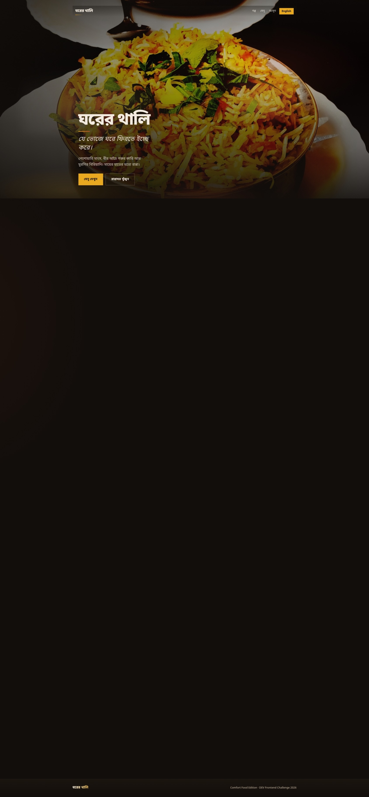

# Ghorer Thali (ঘরের থালি)

Comfort food restaurant landing page for the
[DEV Frontend Challenge: Comfort Food Edition](https://dev.to/challenges/frontend-2026-07-29)
(**Perfect Landing** prompt).



**Live:** [https://ghorer-thali.vercel.app/](https://ghorer-thali.vercel.app/)

## Theme

A fictional Old Dhaka kitchen serving:
- Peshawari meat (namkeen-style broth)
- Beef curry
- Chicken biryani

Bangla is the default language, with an English toggle.

## Stack

- Vite
- React + TypeScript
- Plain CSS (design tokens)
- Deployed on Vercel (`Root Directory`: `landing`)

## Features

- Full-bleed hero with brand-first hierarchy
- Story, interactive menu tabs with dish photos, visit details
- Bangla / English i18n (`localStorage`)
- Accessibility: skip link, semantic landmarks, focus styles, reduced motion

## Project structure

```text
src/
  App.tsx
  main.tsx
  styles/           # tokens + shared UI CSS
  i18n/             # locales (bn/en), LangProvider, types
  data/site.ts      # media URLs, nav, visit field keys
  components/
    ui/             # Button, SectionHeading, SkipLink, LangToggle
    layout/         # Header, Footer
    sections/       # Hero, Story, Menu, Visit
```

## Local development

```bash
npm install
npm run dev